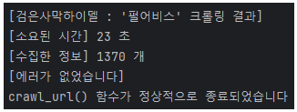
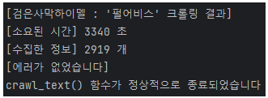
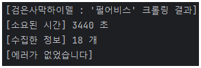

# 멀티스레딩, 멀티프로세싱 테스트

---

## 1. crawl_url() 개선

### 1-a. Test : 기존 코드

- 갤러리 : 검은사막하이델 마이너 갤러리
- 검색 키워드 : 펄어비스
- 검색 기간 : 2023-11-01 ~ 2024-01-17
- 걸린 시간 : 23초

### 1-b. Test : 멀티스레딩

- 걸린 시간 : 24초 (1초 증가)
- 데이터 손실 발생 (결손 데이터 : 14/1370 개, 약 1%)
- 결론 : url 크롤링에서 멀티스레딩은 사용하지 않는다
- 원인 분석 : 한 페이지의 글들을 크롤링하는건 원래도 빠른데, 멀티스레딩을 사용해서 오히려 꼬이는 것 같다

---

## 2. crawl_text() 개선
- 실험 조건
  - 갤러리 : 검은사막하이델 마이너 갤러리
  - 검색 키워드 : 펄어비스 
  - 검색 기간 : 2023-12-01 ~ 2024-01-17
  - row 수 : 717 개
  
### 2-a. Test : 기존 코드

- 갤러리 : 검은사막하이델 마이너 갤러리
- 검색 키워드 : 펄어비스
- 검색 기간 : 2023-11-01 ~ 2024-01-17
- 걸린 시간 : 3340 초
- row 수 : 2919 개

### 2-b. Test 1 (2024-01-19) : 멀티스레딩

- 시간은 더 걸렸고, 정보는 대부분 결손되었다.
- 피드백 : 멀티스레딩에 대해 이해할 필요가 있다.

### 2-c. Test : 멀티프로세싱

